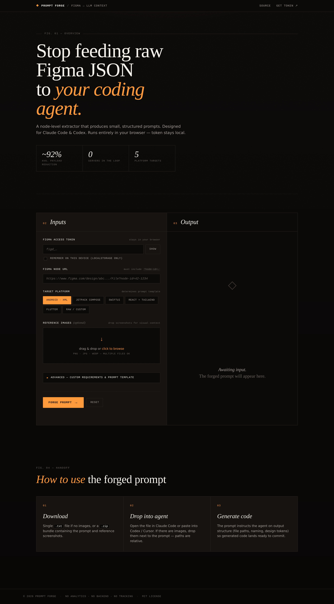

# Figma Prompt Forge

> Distill Figma designs into token-efficient prompts for Claude Code, Codex, and other coding agents.

A pure client-side web tool. Drop in your Figma access token, paste a node URL, optionally attach reference screenshots, and get a ready-to-use prompt file. No backend, no analytics, no token leaves your browser.



---

## Why

Figma's MCP integration and `GET /v1/files/{key}` both stuff the entire raw JSON tree into your model's context. A medium-sized screen can run **100k–500k tokens** of mostly useless data — vector path coordinates, plugin metadata, blend modes, transition info.

This tool extracts the same Figma node via the public REST API, then **cleans aggressively** for code generation:

- Strips vector path data, plugin data, transitions
- Maps Figma auto-layout → `LinearLayout` / `Row` / `flex` / `HStack`
- Deduplicates colors, gathers text styles into a `design_tokens` block
- Converts `rgba` → hex, `px` → `dp` hints
- Marks `INSTANCE` nodes for `<include/>` reuse
- Tags vector nodes for separate asset export

Result: typical reduction of **85–95%**, with structure that's friendlier for an LLM to turn into code.

---

## Local use

Just open `index.html` in a browser. No build step.

```bash
git clone <this-repo>
cd figma-prompt-forge
# python -m http.server 8000  # optional
open index.html
```

You'll need a Figma **Personal Access Token** (free, regardless of Figma plan):
Figma → Settings → Security → **Personal access tokens** → generate.
Required scopes: default (read) is enough.

---

## Deploy to GitHub Pages

### Option A — Auto-deploy via GitHub Actions (recommended)

1. Push this repo to GitHub.
2. Go to **Settings → Pages → Build and deployment → Source: GitHub Actions**.
3. The included `.github/workflows/pages.yml` will deploy on every push to `main`.
4. After ~30 seconds, your site is live at `https://<user>.github.io/<repo>/`.

### Option B — Plain branch deploy (zero workflow)

1. Push to GitHub.
2. **Settings → Pages → Build and deployment → Source: Deploy from a branch**.
3. Branch: `main`, folder: `/ (root)`.
4. Save. Live in a minute.

---

## Workflow

```
┌──────────────┐    ┌──────────────┐    ┌────────────────┐
│  Figma Node  │ →  │   Prompt     │ →  │  Claude Code   │
│  + Token     │    │   Forge      │    │  / Codex /     │
│  + Images    │    │   (browser)  │    │  Cursor        │
└──────────────┘    └──────────────┘    └────────────────┘
                          │
                          ↓
                    .txt or .zip
```

1. **In Figma**: click the frame you want → copy the URL (must include `?node-id=…`).
2. **In Prompt Forge**: paste URL + token, pick target platform, optionally drop screenshots, optionally write custom notes.
3. **Click "Forge prompt"**, then **Download**.
4. **In Claude Code**: drop the downloaded file (or unzip if there are images) into your project, then:
   ```
   @figma_prompt.txt
   Generate the code as specified.
   ```

---

## Supported targets

| Target | Output stack |
|---|---|
| `Android · XML` | Kotlin + XML layouts, ConstraintLayout, Material3, resources split |
| `Jetpack Compose` | Compose Material3, stateless composables, theme tokens |
| `SwiftUI` | iOS 16+, asset catalog colors, localizable strings |
| `React + Tailwind` | TypeScript strict, Tailwind v3, accessible primitives |
| `Flutter` | Material 3, null-safe, themed |
| `Raw / Custom` | Just JSON + your custom template |

Each target's prompt is tuned for the platform's idioms — file structure, naming, theme integration, component mapping.

---

## Customization

Open the **Advanced** drawer in the UI to:

- **Add custom requirements** — appended verbatim to the prompt (e.g. "use Hilt for DI", "dark mode only", "design system X is already present").
- **Override the entire template** — supports `{{json}}`, `{{notes}}`, `{{images}}` placeholders.
- **Fetch a 2x render from Figma** — pulls a PNG of the node directly via the Figma API, bundled into the zip.
- **Include raw JSON** — adds the uncleaned Figma response as `_raw_uncleaned` for debugging.

Templates live in `app.js` under `TEMPLATES`. Tweak directly to match your team's conventions.

---

## Privacy & security

- **Token never leaves your browser.** All Figma API calls happen client-side via `fetch`.
- **localStorage is opt-in.** "Remember on this device" is unchecked by default; otherwise the token is in memory only.
- **No analytics, no third-party scripts** beyond JSZip from jsDelivr (used for bundling images + prompt into a zip).
- All code is in this repo. Audit before trusting.

---

## Limitations & known issues

- **Components vs Component Sets**: Variants are flattened to their selected state. If you need all variants, point at the variant node directly.
- **Boolean operations**: marked as vector assets — easier to export them as drawables than to reconstruct.
- **Very deep trees**: cleaning is capped at depth 14 to keep payloads sane. Adjust in `Cleaner` if needed.
- **Vector inlining**: if you want SVG paths inline rather than asset references, you'd need to extend the cleaner to keep `fillGeometry` data.

---

## License

MIT.
